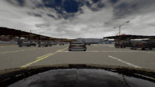
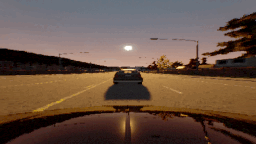
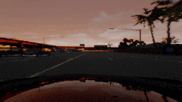

# Risk-Aware Scene Sampling for Dynamic Assurance of Autonomous Systems

High-risk simulation scene generation has recently gained significant interest in the Autonomous Vehicle Domain. Traditional sampling-based approaches have been widely used for this purpose. **Passive samplers** like random search and grid search have been used in the industry. These samplers do not use the feedback of previous simulation results in the sampling process. To perform **active sampling**, we propose two new samplers called **Random Neighborhood Sampler (RNS)** and **Guided Bayesian Optimization (GBO)** in this work. These samplers are based on the conventional random and Bayesian Optimization search techniques and we add capabilities of active sampling, constraint-based sampling, and balancing the exploration vs. exploitation to guide them towards sampling clusters of high-risk scenes. We applied these samplers to an \ac{av} case study in CARLA Simulation. This repo has the steps to run the simulation scene generation with the samplers as discussed in the paper. For this, we leverage the CARLA Autonomous Driving Challenge https://leaderboard.carla.org/ . Some examples of the scenes generated in this work are shown in the gif below. 

<p align="center">
  
  
  
</p>

(Left) Cloudy Scene in an intersection. The AV also has a camera fault (camera occlusion), which makes the AV's driving susceptible by moving it off track. (Center) Sunset scene in a curvy road. There is another vehicle right in front of the AV. (Right) Cloudy Scene with slight rain.  

## Downloads

The following files need to be downloaded and they can be got using one of the follwings methods. 

***Manual Downloads***

***Step 1***: Download [CARLA_0.9.9](https://github.com/carla-simulator/carla/releases/tag/0.9.9/) and put it inside the carla_client folder. Please pull CARLA_0.9.9.0 version. If you pull any other version, there will be a mismatch between the CARLA simulation API and the client API. 

***Step 2***: Pull the trained OOD detector weights from [here](https://vanderbilt365-my.sharepoint.com/:f:/g/personal/shreyas_ramakrishna_vanderbilt_edu/EvZqbV90bY1HmSCofd6A1m0BTlqrPBzOF1gy4vDvAt4KUQ?e=LnHlx6). Please download the folder (center-B-1.2-trial), unzip the folder and save it as "ood_detector_weights" into the following path "/carla_client/carla-challange/leaderboard/team_code/detector_code" .

***Step 3***: The preitrained LEC is got from [Learning By Cheating](https://github.com/bradyz/2020_CARLA_challenge). Download the weights from [here](https://vanderbilt365-my.sharepoint.com/:u:/g/personal/shreyas_ramakrishna_vanderbilt_edu/ETRBzI7Ai3VJt9zL7yPnJO4Bi5zYvgggreiY2CG68f8s8A?e=nGJIQl)

Unzip the weights file and save it as ***model.ckpt*** in the carla-challange/carla_project folder. 

***Automated Downloads (Preferred)***

Enter into this repo and execute this script ```./downloads.sh``` to download these three requirements automatically into the required folders.

## Setup Virtual Environment

To run the scene generation workflow with CARLA, clone this repo.

```bash
git clone https://github.com/scope-lab-vu/Risk-Aware-Scene-Generation-CPS.git
```
Then, create a conda environment to run the experiments. 

```
To run this setup first create a virtual environment with python 3.7
conda create -n carla-sampling python=3.7
conda activate carla-sampling
python3 -m pip install -r requirements.txt
```

# Running the Carla setup 

***Create Folders for Docker Volumes***

Create three folders named ```routes```, ```simulation-data``` and ```images``` inside this directory. These folders are the data volumes for the carla client docker. Run the following

```
mkdir routes               #stores the scene information.
mkdir simulation-data      #stores the sensor information
mkdir images               #stores images if chosen by the user
```
Alternately, enter into this repo and execute this script ```./make_volume_folders.sh``` to set up these empty folders. To clean the content of these folders you can use ```./clean_folders.sh``` script.

***Launch Simulation & Sampler***

Next get into the path of this repo and execute the following script inside the carla-challange folder. This script has a few variables that need to be set before execution. 

1. PROJECT_PATH: Set this to the location of this repo.
1. CARLA_ROOT: Set this to the location of the CARLA_0.9.9 simulator folder. 
2. PORT: The simulator port (default:3000)
3. HAS_DISPLAY: 1 = display simulation run, 2 = headless mode (no display)

```
cd carla-challange
./run_agent.sh n    #where n is the number of scenes to be generated. If not selected, 2 scenes will be generated by default.
```
This script launches both the simulator and the carla client. The simulation data is stored in the routes, simulation-data, and images folders.

This should start running the carla setup with the default random sampler. Different samplers and scene variables can be seected from [scene_description.yml](carla-challange/sdl/scene/scene_description.yml)

# Scene Generation & Samplers
We use a scenario description DSML written in [textX](https://textx.github.io/textX/stable/) to generate different temporal scene parameters (weather parameters, time-of-day,traffic density), spatial scene parameters (road segments) and agent sensor faults. These variables and samplers can be selected using the scene specification file ***carla-challange/sdl/scene/scene_description.yml***

# Samplers

The goal of this work is to test different samplers for sequential scene generation. We have integrated and the user can select from the following samplers.

1. **Manual Sampler** - A sampler in which the user can manually specify the values for the scene variables.
2. **Random Sampler** - A sampler in which the scene variables are sampled uniformly at random from their respective distributions.
3. **Grid Sampler** - A sampler that exhaustively samples all the combinations of the scene variables in a given grid.
4. **Halton Sampler** - A pseudo-random sampler that samples the search space using co-prime as its bases.
5. **Random Neighborhood Search Sampler** - The sampler executes the sequenctial-search strategy discussed in the paper.
6. **Guided Bayesian Optimization Sampler** - The sampler extends the conventional Bayesian Optimization sampler with sampling rules and uses them for sampling the high-risk scenes. 


## References

The experiments in this work are built using these two works.


1. ReSonAte: A Runtime Risk Assessment Framework for Autonomous Systems [paper](https://arxiv.org/abs/2102.09419) - This is our previous work which introduced the ReSonAte risk estimation framework. We use this setup for computing the ReSonAte score in this work. [GitHub](https://github.com/scope-lab-vu/Resonate)

2. Learning By Cheating [paper](https://arxiv.org/abs/1912.12294) - The Learning-Enabled Component (LEC) controller for the AV is borrowed from this work. We also used their autopilot controller to generate scenes in the training and calibration phases. [GitHub](https://github.com/bradyz/2020_CARLA_challenge) 


